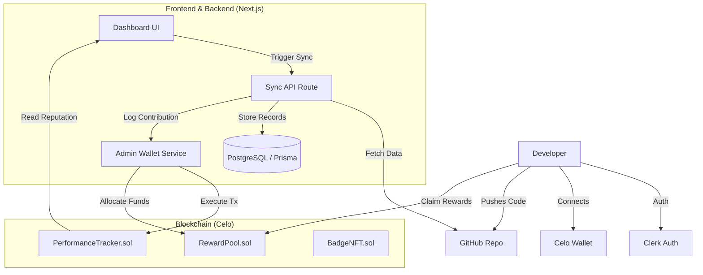

# HackerDAO Task Chain - Project Overview

## 1. Introduction

HackerDAO Task Chain is a decentralized contribution tracking and reward system designed to incentivize open-source development. It bridges the gap between Web2 development activity (GitHub) and Web3 rewards (Celo Blockchain). Developers earn on-chain reputation (points) and token rewards for their contributions (Pull Requests, Issues, Commits).

## 2. Architecture Overview

The project consists of three main pillars:

1. **Frontend Application**: A Next.js dashboard for users to view stats, sync contributions, and manage rewards.
2. **Backend Services**: Next.js API routes and services that handle data synchronization between GitHub, the Database, and the Blockchain.
3. **Blockchain Layer**: Smart contracts deployed on the Celo network that store immutable performance records and manage token rewards.

### High-Level Data Flow

## 3. Detailed Data Flow

### Step 1: Authentication & Onboarding

-   **User Identity**: Managed by **Clerk**. Users sign in using their GitHub accounts.
-   **Wallet Connection**: Managed by **Wagmi/Viem**. Users connect their Celo-compatible wallet (e.g., MetaMask, Valora).
-   **Profile Linking**: The system links the Clerk User ID (GitHub username) with the connected Wallet Address in the PostgreSQL database.

### Step 2: Contribution Synchronization

-   **Trigger**: Currently manual via the "Sync" button on the dashboard (or potentially automated via webhooks in the future).
-   **Process**:
    1. The `SyncAPI` (`/api/sync/contributions`) calls the GitHub API to fetch recent Pull Requests, Issues, and Commits.
    2. It filters for contributions made by the registered user.
    3. It checks the **PostgreSQL Database** to ensure the contribution hasn't been recorded yet.
    4. New contributions are saved to the database with metadata (repo, type, timestamp).

### Step 3: Blockchain Recording (The "Bridge")

-   **Mechanism**: To ensure a seamless user experience (gasless for the user during logging), the system uses a backend **Admin Wallet**.
-   **Action**: When a valid contribution is synced:
    1. The `blockchain-admin.ts` service is invoked.
    2. It signs a transaction using the `ADMIN_PRIVATE_KEY`.
    3. It calls `logContribution(userAddress, type, points)` on the **PerformanceTracker** smart contract.
    4. (Optional) It calls `addReward(userAddress, amount)` on the **RewardPool** smart contract.
-   **Result**: The user's on-chain reputation score increases immediately.

### Step 4: Rewards & Badges

-   **Claiming**: Users can view their accumulated rewards on the dashboard. They interact directly with the **RewardPool** contract to `claimReward()`, transferring tokens to their wallet.
-   **Badges**: Milestones (e.g., "10 PRs") can trigger the minting of a **BadgeNFT**. This is also handled by the Admin Wallet to award the NFT to the user.

## 4. Technical Stack

### Frontend (`/frontend`)

-   **Framework**: Next.js 16 (App Router)
-   **Language**: TypeScript
-   **Styling**: Tailwind CSS, Lucide React
-   **State/Data**: Prisma (ORM), SWR/React Query (implied), Server Actions
-   **Blockchain Client**: Wagmi, Viem

### Blockchain (`/blockchain`)

-   **Framework**: Hardhat
-   **Language**: Solidity
-   **Network**: Celo Sepolia (Testnet)
-   **Contracts**:
    -   `PerformanceTracker.sol`: Stores user points and contribution history.
    -   `RewardPool.sol`: Manages an escrow of tokens to be claimed by users.
    -   `BadgeNFT.sol`: ERC721 token for achievements.

### Database

-   **Type**: PostgreSQL
-   **Schema**:
    -   `User`: Links Clerk ID, Wallet, and GitHub Username.
    -   `Contribution`: Off-chain record of work.
    -   `Reward`: Off-chain record of pending/claimed rewards.
    -   `Organization/Repo`: Mirrors GitHub structure for multi-tenant support.

## 5. Key Configuration Files

-   `frontend/prisma/schema.prisma`: Database models.
-   `frontend/lib/blockchain-admin.ts`: Backend logic for writing to the blockchain.
-   `frontend/services/github-contributions.service.ts`: Logic for fetching data from GitHub.
-   `blockchain/contracts/*.sol`: Smart contract logic.
